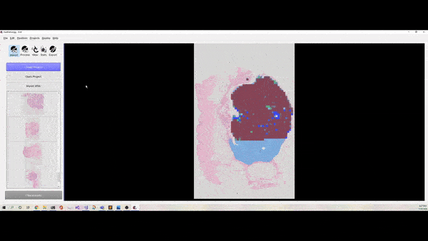

FastPathology
===================================
[](https://github.com/SINTEFMedtek/FAST-Pathology/releases)
[](https://opensource.org/licenses/BSD-2-Clause)
[](https://doi.org/10.1109/ACCESS.2021.3072231)


FastPathology is an open-source platform for deep learning-based research and decision support in digital pathology, created by SINTEF Medical Technology and the Norwegian University of Science and Technology (NTNU).

**A paper presenting the software and some benchmarks has been published in [IEEE Access](https://ieeexplore.ieee.org/document/9399433). The paper is open-access and can be accessed directly from [this link](https://ieeexplore.ieee.org/stamp/stamp.jsp?tp=&arnumber=9399433).**



Install
-----------------------------------
**Download an appropriate installer from the [release page](https://github.com/SINTEFMedtek/FAST-Pathology/releases/), or the most recent one from [here](https://andreped.github.io/fastpathology.github.io/)**. 

Installers for Win10, Ubuntu Linux (18 and 20), and macOSX are available. The software is continuously in development. It has not reached a stable state _yet_, but we are pushing towards a major release soon. Beta-testers are much obliged.

**NOTE:** FastPathology depends on OpenCL. Most Windows machines have OpenCL by default, whereas Ubuntu does not. Thus, for Ubuntu, OpenCL can be installed by installing either [NVIDIA CUDA Toolkit](https://developer.nvidia.com/cuda-11.1.0-download-archive) or [Intel OpenCL Driver](https://github.com/intel/compute-runtime). CUDA is required if you wish to perform inference using a dedicated GPU. CUDA 11.0 if you are using any of the releases.

Test data
-----------------------------------
Data for testing the application can be downloaded from [here](http://folk.ntnu.no/andpeder/). It includes some pretrained models, two WSIs, and some example text pipelines. If [curl](https://curl.se/) and [tar](https://wiki.haskell.org/How_to_unpack_a_tar_file_in_Windows) is installed on the machine, it is possible to download the data directly from the GUI (go to the menu bar -> Edit -> Download test data -> click "Yes" -> when finished, click "Yes" again to visualize the WSIs straight away).

Features
-----------------------------------
The software is implemented in C++ based on [FAST](https://github.com/smistad/FAST). A wide range of features have been added to the platform and FAST to make working with Whole Slide Images (WSIs) a piece of cake!
* **Graphical User Interface -** User-friendly GUI for working with WSIs without any code interaction
* **Deep learning -** Deployment and support for multi-input/output Convolutional Neural Networks (CNNs)
* **Visualization -** Real-time streaming of predictions on top of the WSI with low memory cost
* **Use cases -** Patch-wise classification, low and high-resolution segmentation, and object detection are supported
* **Inference Engines -** FAST includes a variety of different inference engines, i.e. TensorFlow CPU/CUDA (support both TF v1 and v2 models), TensorRT (UFF and ONNX) and OpenVINO (CPU/GPU/VPU).
* **Text pipelines -** Possibility to create your own pipelines using the built-in script editor
* **Formats -** Through OpenSlide FastPathology supports lots of WSI formats

Demos
-----------------------------------
Very simple demonstrations of the platforms can be found on [Youtube](https://www.youtube.com/channel/UC4GM2KW54-vEZ0M1kH5-oig). More in-depth demonstrations will be added in the future. However, some wikis and tutorials can be found in the [wiki](https://github.com/SINTEFMedtek/FAST-Pathology/wiki). More information can be found from the **pages** section on the right in the wiki home.

Applications of FastPathology
-----------------------------------
* Pettersen et al., Code-free development and deployment of deep segmentation models for digital pathology, Frontiers in Medicine, https://www.frontiersin.org/articles/10.3389/fmed.2021.816281/abstract
* Pedersen et al., Hybrid guiding: A multi-resolution refinement approach for semantic segmentation of gigapixel histopathological images, preprint arXiv: https://arxiv.org/abs/2112.03455

Development setup
-----------------------------------
1. Either
   - [Download and install a release of FAST](https://fast.eriksmistad.no/install.html).
   - [Compile and install FAST on your system](https://fast.eriksmistad.no/building-fast.html).
2. Clone this repository
   ```bash
   git clone https://github.com/SINTEFMedtek/FAST-Pathology.git
   ```
3. Setup build environment using CMake  
   *Linux (Ubuntu)*
   ```bash
   mkdir build
   cd build
   cmake .. -DFAST_DIR=/path/to/FAST/cmake/
   ``` 
   *Windows (Visual Studio)*
   Modify generator -G string to match your Visual studio version. This command will create a visual studio solution in your build folder.
   ```bash
   mkdir build
   cd build
   cmake .. -DFAST_DIR=C:\path\to\FAST\cmake\ -G "Visual Studio 16 2019" -A x64
   ```
4. Build
   ```bash
   cmake --build . --config Release --target fastpathology
   ```
5. Run
   *Linux (Ubuntu)*
   ```bash
   ./fastpathology
   ```
   *Windows*
   ```powershell
   cd Release
   fastpathology.exe
   ```

**NOTE:** Visual Studio 19 have been tested with both FAST and FastPathology and works well.

How to cite
-----------------------------------
Please, consider citing our paper, if you find the work useful:
<pre>
  @ARTICLE{9399433,
  author={Pedersen, André and Valla, Marit and Bofin, Anna M. and De Frutos, Javier Pérez and Reinertsen, Ingerid and Smistad, Erik},
  journal={IEEE Access}, 
  title={FastPathology: An Open-Source Platform for Deep Learning-Based Research and Decision Support in Digital Pathology}, 
  year={2021},
  volume={9},
  number={},
  pages={58216-58229},
  doi={10.1109/ACCESS.2021.3072231}}
</pre>

